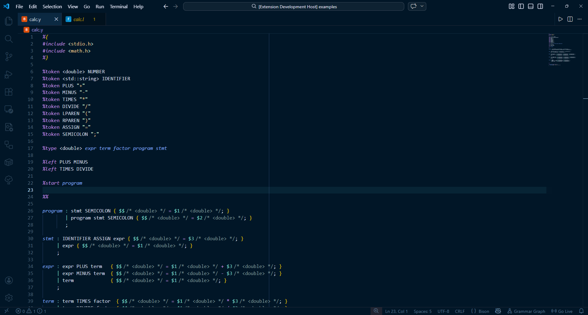
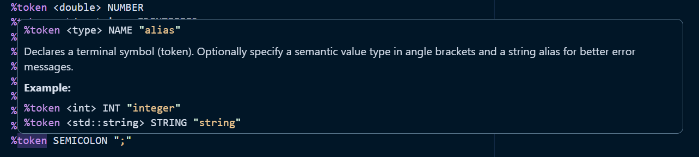
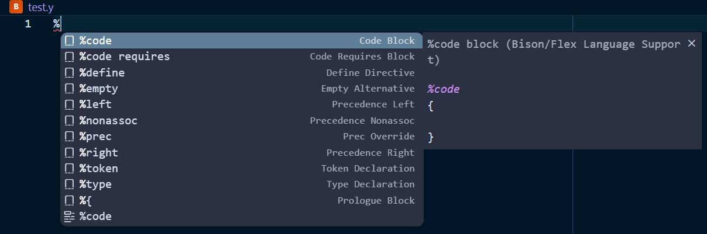
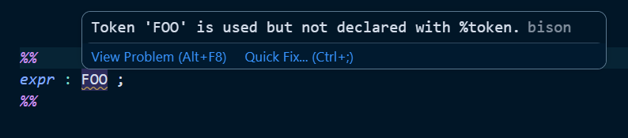
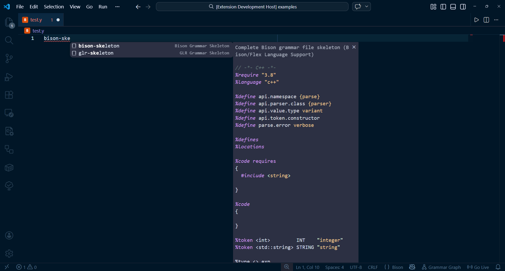

# Bison/Flex Language Support

[](https://marketplace.visualstudio.com/items?itemName=theodevelop.bison-flex-lang)
[](https://marketplace.visualstudio.com/items?itemName=theodevelop.bison-flex-lang)
[](https://marketplace.visualstudio.com/items?itemName=theodevelop.bison-flex-lang)
[](https://open.vsx.org/extension/theodevelop/bison-flex-lang)
[](https://github.com/theodevelop/bison-flex-lang/actions/workflows/ci.yml)
[](LICENSE)

Full-featured language support for **GNU Bison** (`.y`, `.yy`) and **Flex/RE-flex** (`.l`, `.ll`) in Visual Studio Code.

Build parsers and lexers with confidence — get syntax highlighting with embedded C/C++, real-time error detection, intelligent autocompletion, and inline documentation for every directive.

---

## Features

### Syntax Highlighting

Section-aware highlighting that understands the structure of Bison and Flex files: declarations, rules, and epilogue/user code sections are each highlighted differently.

- **Bison**: directives (`%token`, `%type`, `%define`, `%code`...), rule definitions, `$$`/`$1`/`@$` semantic values, `<type>` annotations, `%prec`, `|` alternatives
- **Flex**: directives (`%option`, `%x`, `%s`), `<SC_NAME>` start conditions, `{abbreviation}` references, `<<EOF>>`, regex character classes `[a-z]`, escape sequences
- **Embedded C/C++**: full C++ highlighting inside `%{ %}`, `%code { }`, `%top{ %}`, `%class{ }`, and action blocks `{ ... }` — powered by VS Code's built-in C++ grammar

### Diagnostics

Real-time error detection as you type:

| Bison | Flex |
|-------|------|
| Undeclared tokens used in grammar rules | Undefined start conditions (`<SC_NAME>` not declared with `%x`/`%s`) |
| `%type` declarations for non-existent rules | Undefined abbreviation references (`{name}` not in definitions) |
| Missing `%%` section separator | Missing `%%` section separator |
| Unclosed `%{ %}` code blocks | Unclosed `%{ %}` code blocks |
| Missing `%type` with `variant` semantic values | Unused start conditions and abbreviations |
| Unused grammar rules (unreachable from start symbol) | Inaccessible rules (catch-all before specific pattern, or duplicate) |
| Unused tokens (declared but never referenced) | Unknown/invalid directive |
| Shift/reduce conflict heuristic | |
| Unknown/invalid directive | |

### Autocompletion

Context-aware suggestions triggered as you type:

- **All Bison directives** (30+): `%token`, `%type`, `%define`, `%left`, `%right`, `%nonassoc`, `%precedence`, `%code`, `%skeleton`, `%glr-parser`, `%expect`, `%require`, `%language`, `%locations`, `%printer`, `%destructor`, `%param`...
- **All `%define` variables**: `api.value.type`, `api.token.prefix`, `api.namespace`, `api.parser.class`, `api.token.constructor`, `parse.error`, `parse.lac`, `lr.type`...
- **All Flex `%option` values** (20+): `noyywrap`, `bison-complete`, `bison-cc-parser`, `bison-locations`, `reentrant`, `debug`, `yylineno`, `stack`...
- **Token and non-terminal names** from your declarations (in the rules section)
- **Semantic values**: `$$`, `$1`–`$9`, `@$`, `@1`–`@9`
- **Start conditions** and **abbreviation names** (Flex, in rules)
- **Code snippets**: full grammar/scanner skeletons, rule templates, comment/string handlers

### Hover Documentation

Hover over any directive or keyword to see its documentation:

- Signature, description, and usage example for every Bison directive
- Documentation for all `%define` configuration variables
- Explanation of semantic value references (`$$`, `$1`, `@$`, `@1`)
- Flex `%option` value descriptions (including RE-flex-specific options)
- Built-in function docs: `start()`, `text()`, `BEGIN`, `ECHO`, `REJECT`, `<<EOF>>`
- Token and non-terminal info from your own declarations

### Snippets

Ready-to-use templates to speed up your workflow:

**Bison** (14 snippets):
- `bison-skeleton` — Complete grammar file template
- `rule` — Grammar rule with action
- `%token`, `%type`, `%code requires`, `%define`, `%left`, `%right`, `%nonassoc`
- `%empty`, `%prec`, `%{`

**Flex** (12 snippets):
- `flex-skeleton` — Complete Flex scanner template
- `reflex-skeleton` — Complete RE-flex scanner template
- `comment-handler` — Nested comment handler with start conditions
- `string-handler` — String literal handler with escape sequences
- `rule`, `rule-sc`, `%option`, `%x`, `%top`, `%class`, `eof-handler`

---

## Screenshots

### Syntax Highlighting


### Hover Documentation


### Autocompletion


### Diagnostics


### Snippets


---

## Supported File Types

| Language | Extensions | Aliases |
|----------|-----------|---------|
| Bison | `.y`, `.yy`, `.ypp`, `.bison` | Bison, Yacc |
| Flex | `.l`, `.ll`, `.lex`, `.flex` | Flex, Lex, RE-flex |

---

## Installation

### From the Marketplace

Search for **"Bison/Flex Language Support"** in the VS Code Extensions panel (`Ctrl+Shift+X`).

### From VSIX

```bash
code --install-extension bison-flex-lang-1.0.0.vsix
```

### From Source

```bash
git clone https://github.com/theodevelop/bison-flex-lang.git
cd bison-flex-lang
npm install
npm run compile
```

Then press `F5` in VS Code to launch the Extension Development Host.

---

## Configuration

| Setting | Type | Default | Description |
|---------|------|---------|-------------|
| `bisonFlex.enableDiagnostics` | `boolean` | `true` | Enable/disable real-time error detection |
| `bisonFlex.maxDiagnostics` | `number` | `100` | Maximum number of diagnostics per file |
| `bisonFlex.bisonPath` | `string` | `"bison"` | Path to the Bison executable (must be in PATH or absolute) |
| `bisonFlex.flexPath` | `string` | `"flex"` | Path to the Flex executable (must be in PATH or absolute) |

---

## Build Integration (tasks.json)

Drop this `.vscode/tasks.json` into your Bison/Flex project to get `Ctrl+Shift+B` build support with problem matchers:

```json
{
  "version": "2.0.0",
  "tasks": [
    {
      "label": "Build (Bison + Flex + Make)",
      "type": "shell",
      "command": "make",
      "group": { "kind": "build", "isDefault": true },
      "presentation": { "reveal": "always", "panel": "shared" },
      "problemMatcher": [
        {
          "owner": "bison",
          "fileLocation": ["relative", "${workspaceFolder}"],
          "pattern": {
            "regexp": "^(.+?):(\\d+)(?:\\.(\\d+))?:\\s+(warning|error):\\s+(.+)$",
            "file": 1, "line": 2, "column": 3, "severity": 4, "message": 5
          }
        },
        {
          "owner": "flex",
          "fileLocation": ["relative", "${workspaceFolder}"],
          "pattern": {
            "regexp": "^(.+?):(\\d+):\\s+(warning|error):\\s+(.+)$",
            "file": 1, "line": 2, "severity": 3, "message": 4
          }
        }
      ]
    },
    {
      "label": "Bison: Compile current file",
      "type": "shell",
      "command": "bison",
      "args": ["-d", "-v", "${file}"],
      "group": "build",
      "problemMatcher": []
    },
    {
      "label": "Flex: Compile current file",
      "type": "shell",
      "command": "flex",
      "args": ["-o", "${fileBasenameNoExtension}.c", "${file}"],
      "group": "build",
      "problemMatcher": []
    }
  ]
}
```

> **Tip**: `bison -d` generates the `.tab.h` header; `-v` produces the `.output` report with the parse table.

---

## Architecture

The extension uses a **Language Server Protocol (LSP)** architecture:

- **Client** (`client/`): thin VS Code extension that starts the language server
- **Server** (`server/`): Node.js process that provides diagnostics, completion, and hover
  - Hand-written parsers for Bison and Flex files (line-by-line, section-aware)
  - Document model cached per file, re-parsed on every change
- **Grammars** (`syntaxes/`): TextMate grammars with embedded C++ delegation

---

## Contributing

Contributions are welcome! Here's how to get started:

1. Fork the repository
2. Create a feature branch: `git checkout -b feature/my-feature`
3. Install dependencies: `npm install`
4. Build in watch mode: `npm run compile:watch`
5. Press `F5` to test in the Extension Development Host
6. Commit your changes and open a Pull Request

### Running Tests

```bash
npx ts-node --project server/tsconfig.json tests/test-parsers.ts
```

### Building for Production

```bash
npm run package          # Production webpack build
npx vsce package         # Create .vsix file
```

---

## Known Limitations

- Diagnostics are based on static analysis of the grammar file structure, not on running Bison/Flex. Some valid constructs may trigger warnings.
- Embedded C/C++ highlighting relies on VS Code's built-in C++ grammar. Complex template expressions may occasionally confuse the highlighter.
- Brace depth tracking in action blocks uses a simplified scanner that does not fully parse C++ strings and comments — deeply nested code blocks with unbalanced braces in string literals may cause highlighting drift.

---

## License

[MIT](LICENSE)
